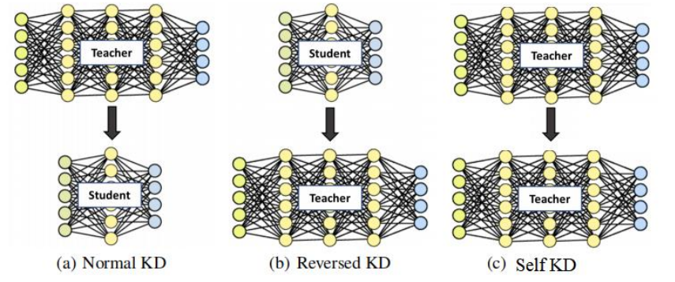

# Deep Neural Network Knowledge Distillation

**Knowledge distillation** is a **model compression** method with the goal of deploying  deep networks in low computation required and storage limited devices without significant decrease in accuracy.  In this repository, we implement three different model distillation methods: normal KD, reverse KD and self KD. 

Firstly, we checked the performance of distilling smaller linear models (student) from larger  linear models (teacher) (**Normal KD**).

- Compare performance and efficiency of the larger model trained on true labels with that  of the smaller model.
- Train a smaller model on a combination of true labels and soft labels from teacher model, then compare it with teacher model as well as the small model trained only on true labels.
- Experiment with adding temperature and the effect of different temperatures on the performance of distilled student model.
- Use distilled models‘ prediction on the omitted digit to evaluate the generalization ability learned from teacher model.

Then we let large model (teacher) learn from small model (student) (**Reversed KD**).

- Train the large model on a combination of true labels and soft labels from the small model. Then compare the accuracy of the large model learned from the small model with a large model learned from the ground truth.

At last, we let models learn from themselves (**Self KD**).

- Train a student model on a combination of true and soft labels from a teacher model. The  teacher model shares the same network structure as the student model. Then compare performance between teacher and student model.

## Run the notebooks

The notebooks are named in the questions order and stored in ./notebooks folder.   

#### Q1 

**Notebook:**  question_1_cumbersome_small_model.ipynb

#### Q2 

**Notebook:**  question_2_distils_outperforms.ipynb

#### Q3 

**Notebook:**  

#### Q4 

**Notebook:**  

#### Q5

**Notebook:**  question_5_6_reverse_and_self_KD.ipynb

The question 5 was answered in section **Reverse KD** .  Please make sure run the following sections at first.

- Import necessary dependencies
- Download Data - CIFAR10
- Model Define
- KD Utility Functions

#### Q6 

**Notebook:**  question_5_6_reverse_and_self_KD.ipynb

The question 6 was answered in section **Self KD ** .  Please make sure run the following sections at first.

- Import necessary dependencies
- Download Data - CIFAR10
- Model Define
- KD Utility Functions

## Checkpoints

If you don't want to run the code from scratch, you can download the checkpoints in the ./checkpoints  of the models. 

